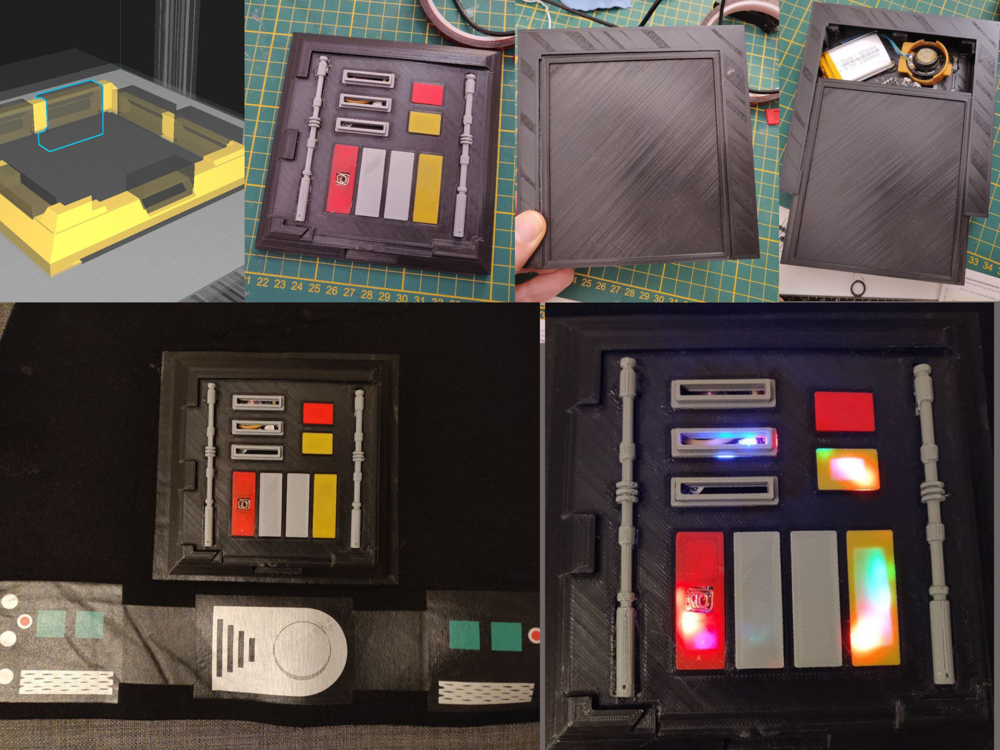
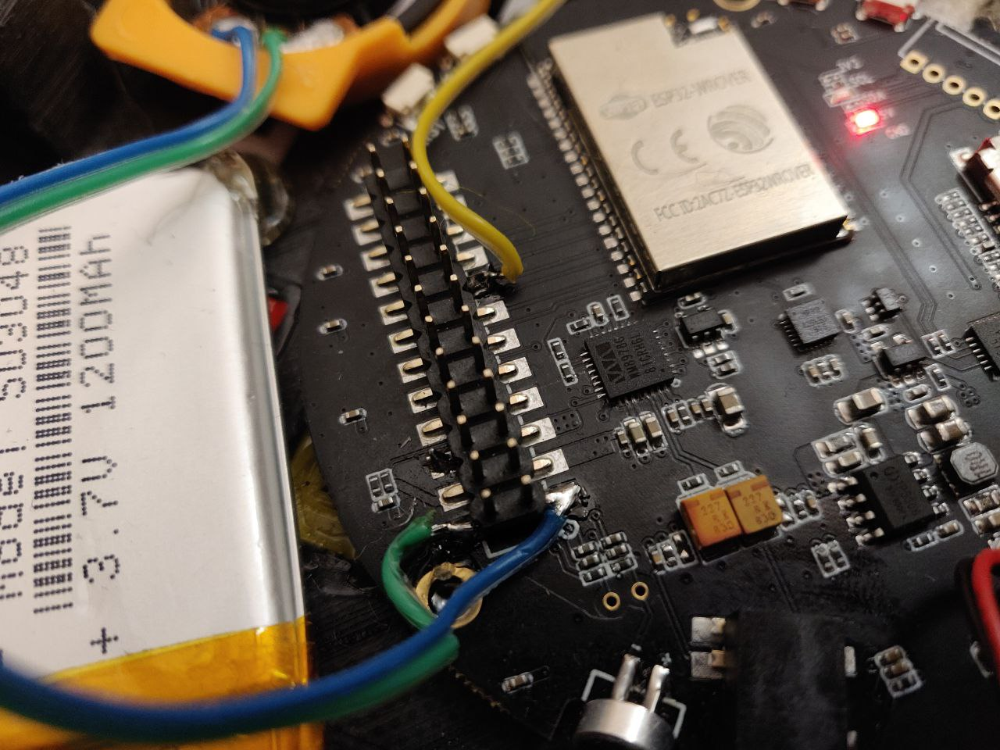
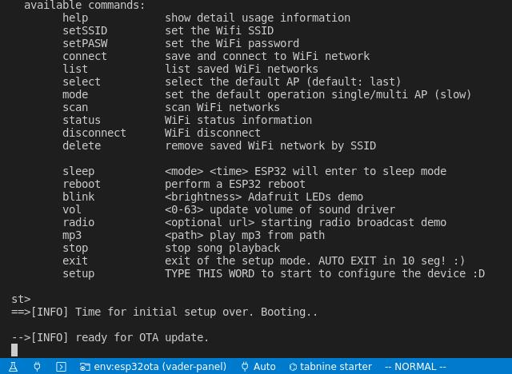

# Darth Vader Frontal Panel

Basic sound effects and LED control of TTGO TAudio ESP32 board for a Darth Vader frontal panel gadget. Includes its box for 3D printing with many improvements from the original box, see the [Credits](#Credits).



## Features

- [x] Set the custom sounds via SD card
- [x] Support OTA updates via LAN (for improve development)
- [x] WiFi proviosining and audio tools via CLI serial
- [x] Touch button (only one for now)
- [x] Multitasking using FreeRTOS tasks for audio and LEDs
- [ ] Auto load new sounds from SD card (now is static)
- [ ] Auto sound using IMU
- [ ] Auto load new mp3 files via Bluetooth
- [ ] Microphone ?

## Prerequisites

Format a SD card on FAT and put the [mp3](mp3) folder contents to a new **"vader"** named folder.

## Build and Upload

Please install first [PlatformIO](http://platformio.org/) open source ecosystem for IoT development compatible with **Arduino** IDE and its command line tools (Windows, MacOs and Linux). Also, you may need to install [git](http://git-scm.com/) in your system. After install that you should have the command line tools of PlatformIO. Please test it with `pio --help`. Then please run the next command for build and upload the firmware:

```bash
pio run --target upload
```

## Wiring and connections

Not to much, only the speaker to LOUT2, ROUT2 and the touch button to IO04 for now. For the speaker, please use a speaker of 8Ω. In the [docs folder](docs/) you have the schematics for these connections, but is only this:



## Troubleshooting

- If you have issues with the upload command, and your board cannot receive the firmware via Serial, please remove your SD card first, and try again. Also you able to send the firmware via WiFi using OTA from PlatformIO, for that you only need change the env to `esp32ota` on VSCode for example.

- The TTGP T9 Audio v1.0 has a [issue](https://github.com/LilyGO/TTGO-TAudio/issues/7) with deepsleep, right now this improvement for low power consumption is disabled, only works with permanent USB connection, but with a LIPO Battery with 1000mAh or more it should be working for 5 hours or more, it is sad because without this issue, maybe days.

## Configuration

Using your USB cable, connect it and run:

```bash
pio device monitor
```

or any serial monitor like `picocom`, and configure the WiFi credentials using the [ESP32WiFiCLI](https://github.com/hpsaturn/esp32-wifi-cli#readme) like this:

[](https://github.com/hpsaturn/esp32-wifi-cli#readme)

Press enter and type help. You should see the configuration commands for setup your WiFi and panel settings. Also you able to did some tests over the T9Audio board, like run radio, mp3:  



## Demo

https://user-images.githubusercontent.com/423856/221437480-ac313f3f-cbc1-4a08-a20b-a76649b9068e.mp4

## Credits

Original box unfinished from [Thingiverse @alexgeiger](https://www.thingiverse.com/thing:2048281/files)
