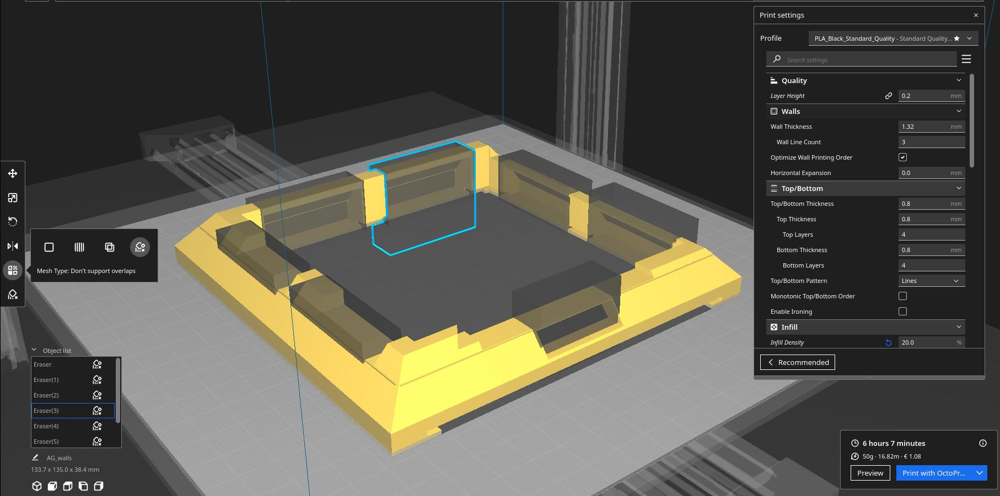

## Box specs and tips

- NOTE: All models here needs to scale to 1600% to have a box around 13.5 cm.
- The main box or walls, needs supports but you can use "Don't use support overlapping boxes" for reducing these. (see the Cura screenshots)
- Some buttons and rockers can be in different colors
- Use glue to fix the components to frontal lid.

### Materials

- Tested with PLA
- precision 0.2 (high layer)

